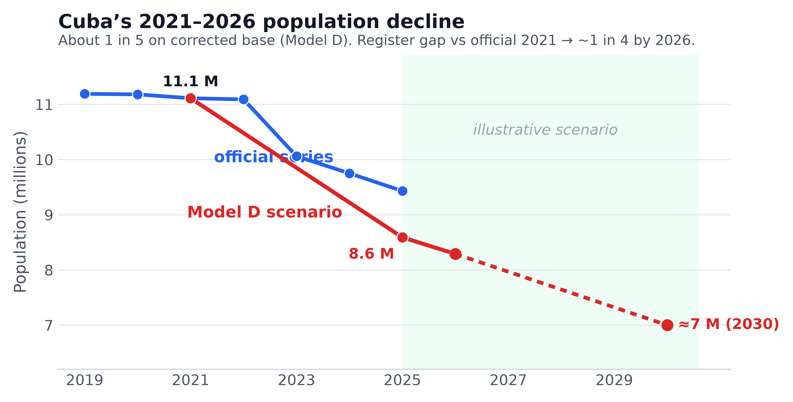
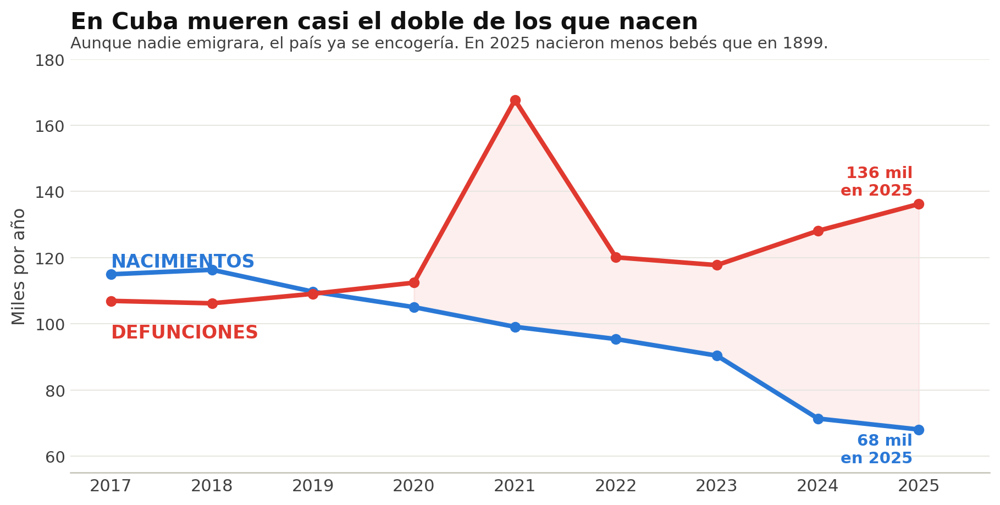
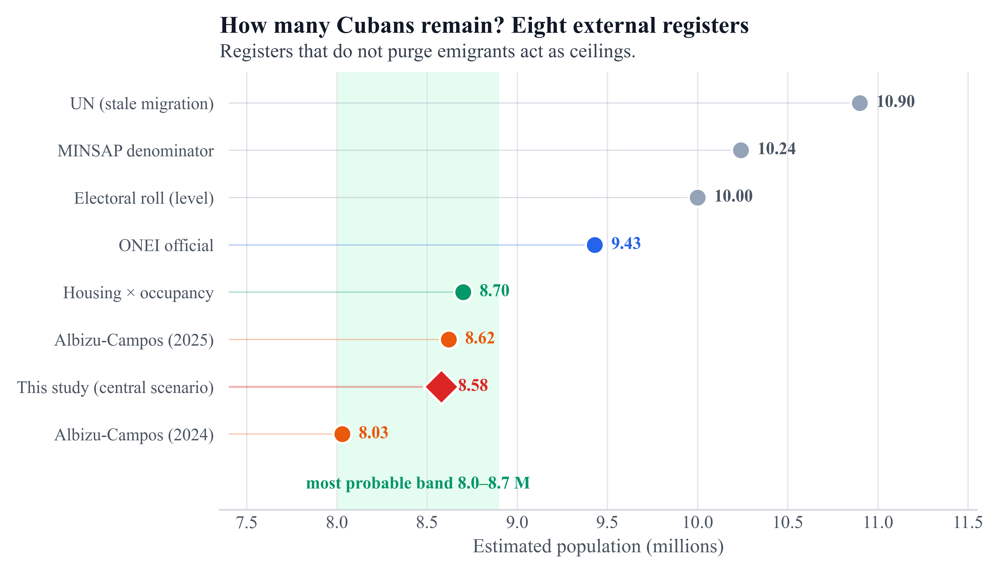
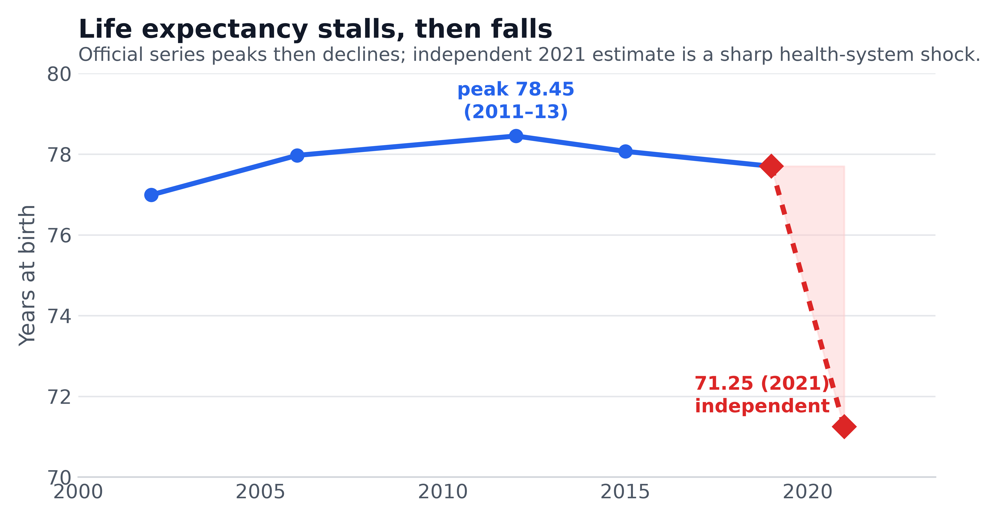
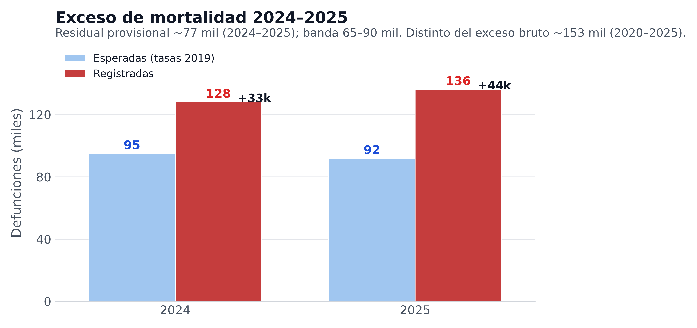
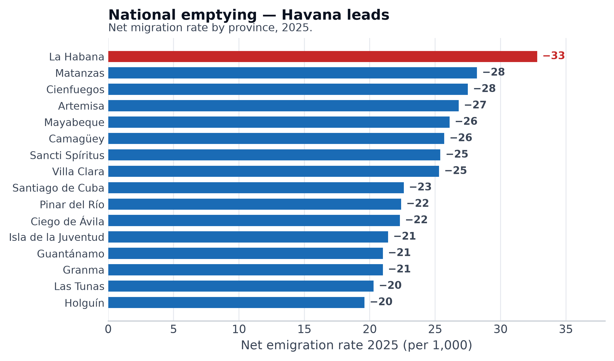
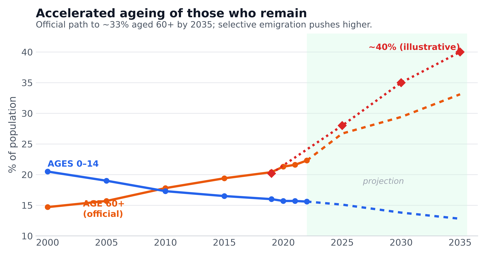

# Estimando la despoblación de Cuba, 2021–2026

> **Artículo de divulgación** (comunicación pública). No es un artículo científico revisado por pares.
> La versión científica en inglés (LaTeX/PDF) y el cuaderno reproducible están en el repositorio
> [ypriverol/cubascience](https://github.com/ypriverol/cubascience) → `demographics/`.
> Sitio: [ypriverol.github.io/cubascience/demographics](https://ypriverol.github.io/cubascience/demographics/).

*Alrededor de **una de cada cinco personas** sobre la base corregida (escenario D, fin-2025). Contra la población **oficial de 2021**, la brecha hacia fin-2026 se acerca a **uno de cada cuatro** — definiciones distintas.*

---

En mi propia familia, tres miembros han muerto en los últimos seis años. Otros se fueron de la isla. Cada cubano que conozco cuenta una versión de la misma historia: el grupo de WhatsApp donde la mitad de los números empiezan ya por +1, +34 o +598; el barrio donde la luz se va doce horas y otra casa se queda en silencio, con sus dueños en Miami, Madrid o Montevideo.

Las anécdotas no son estadísticas. Pero en el caso de Cuba las estadísticas mismas están en disputa: el último censo fue en **2012**, el previsto para 2022 se ha pospuesto una y otra vez (ahora se promete para 2026), y la oficina de estadística borró un millón de personas de sus propias cifras en un solo anuncio. Así que este texto intenta algo concreto: estimar, con todo el rigor que los datos permiten, **cuánto ha caído la población de Cuba desde finales de 2021**, ponerle un intervalo de confianza honesto, y proyectarla hasta el final de este año.

**Una advertencia por delante.** Antes de escribir esto sometí mis propias cifras a una *revisión adversarial* (le pedí a un demógrafo escéptico que las atacara con todas sus fuerzas) y el resultado cambió cómo presento la conclusión. La revisión me dio la razón en una cosa y me corrigió en otra, y ambas importan:

- **Me corrigió:** por más que las muertes por COVID, dengue, chikungunya y apagones sean reales y trágicas, esta es, en un **~91%, una crisis de emigración, no de mortalidad** (ventana 2021→2025). Aun contando cada muerte oculta que la evidencia permite, las defunciones explican solo una fracción menor de la caída. Quien quiera entender la despoblación de Cuba tiene que mirar los aviones y las balsas, no solo los cementerios.
- **Me dio la razón, y aquí está tu intuición, que era correcta:** las cifras oficiales probablemente **subestiman** la pérdida, pero por una razón migratoria, no de muertes. La ONEI solo cuenta como "emigrante" a quien lleva ~24 meses fuera; quien se fue en 2024–2025 casi no aparece todavía. Ese rezago hace que incluso mi escenario más pesimista pueda quedarse corto. Y al auditar los propios números del régimen (§6) aparece la prueba: la ONEI declaró un saldo migratorio de **+991 personas en 2022**, el mismo año en que 313,506 cubanos entraron solo a Estados Unidos. Los números oficiales no cuadran consigo mismos.

Con eso en mente, construyo **cinco escenarios** (A–E) en lugar de una sola cifra:

| Modelo | Qué asume | Caída 2021→2025 | Población fin-2025 |
|---|---|---|---|
| **A · conservador** | ancla en las cifras oficiales revisadas de la ONEI | **1.80 M (16.4%)** | **9.16 M** |
| **B · ajustado por crisis** | subregistro de muertes + emigración hacia estimaciones independientes | **2.19 M (20.4%)** | **8.57 M** |
| **C · estrés alto** | emigración y mortalidad al límite de lo que la evidencia permite | **2.41 M (22.6%)** | **8.26 M** |
| **D · centinela ★** *(escenario central ilustrativo)* | check IMR + priores migratorios como B; no es un estimador identificado | **2.21 M (20.5%)** | **8.59 M** |
| **E · reconstrucción vital (prov.)** | HSDS → nacimientos/muertes; \(U_0\) distinto de D | **2.13 M (19.2%)** | **8.96 M** |

La **incertidumbre primaria** es la horquilla **A–D (~1.8–2.4 M)**, no el intervalo interno de un solo modelo.
El **Modelo D** es el escenario central ilustrativo: reemplaza los multiplicadores de mortalidad arbitrarios de B/C por un check de consistencia con la mortalidad infantil (§5). Converge con B en ~8.6 millones porque **dominan los priores migratorios**, no porque la migración esté identificada por destinos.

Nada parecido a ninguna de estas cifras le ha ocurrido a un país latinoamericano en tiempos de paz. Los análogos que los demógrafos usan para comparar son guerras. Y si las tendencias actuales continúan, mi proyección sitúa a Cuba en torno a **7 millones para 2030, y posiblemente en apenas 6 millones.** Para **fines de este año, 2026**, los cuatro modelos coinciden en que la isla habrá perdido **~300,000 personas más**, quedando entre **7.9 y 8.9 millones** (Modelo D: **8.29 M**).

Aquí está cómo llegué a todo esto, por qué creo que la realidad está en la mitad pesimista del rango, y (crucialmente) dónde el propio método puede estar equivocándose.

---

## 1. Tres versiones de la verdad

Cualquier estimación tiene que partir de un hecho incómodo: existen tres series de población para Cuba, oficiales o semioficiales, mutuamente incompatibles.

**La serie de la ONU (~10.9 millones en 2025).** La revisión 2024 de *World Population Prospects* todavía muestra a Cuba deslizándose suavemente de 11.2 millones (2019) a 10.9 (2025), porque su modelo asume una emigración neta de apenas ~22,000 personas al año, una cifra equivocada en un orden de magnitud respecto de lo que reporta cualquier otra fuente, incluido el propio gobierno cubano. El Banco Mundial reproduce estos números. Para esta pregunta, la serie de la ONU no es un contendiente serio; la trato como un techo obsoleto.

**La serie de la ONEI (9.43 millones a fin de 2025).** La oficina de estadística de Cuba publicó durante años una población clavada en 11.1–11.2 millones. Luego, el 19 de julio de 2024, el subdirector Juan Carlos Alfonso Fraga informó a la Asamblea Nacional que la "población efectiva" (personas que realmente acumulan ≥180 días de residencia al año en la isla) era de **10,055,968 a fin de 2023**, una revisión a la baja de cerca de un millón, reconociendo que **1,011,269 personas emigraron solo en 2022–2023.** Las actualizaciones siguientes llegaron como un reloj: **9,748,007 a fin de 2024** y, anunciado en julio de 2026, **9,434,593 a fin de 2025** (otras 313,414 personas menos, unas 860 por día).

**La serie independiente (~8.0 millones a fin de 2024).** El demógrafo cubano **Juan Carlos Albizu-Campos** sostiene que incluso las cifras revisadas de la ONEI subestiman el éxodo. Usando los padrones electorales (2013 vs 2023) para detectar emigración no registrada, estimó la población real en **8.63 millones a fin de 2023**; en una actualización de 2025, apoyada en datos de llegadas a EEUU, la situó en **8.03 millones a fin de 2024**, una caída del 24% en cuatro años, "un descenso que solo ocurre en tiempos de guerra."

El rango honesto para fin de 2024 va de **8.0 a 11.0 millones** según a quién se le crea. Esa horquilla (casi 3 millones de personas, más de una cuarta parte del país) es la denuncia más clara de la ausencia de un censo.

## 2. Qué causó realmente la caída

La aritmética del cambio poblacional tiene solo tres términos: nacimientos, muertes y migración. Los tres se han movido contra Cuba a la vez.

### La emigración: el término dominante (~91% de la pérdida)

Insisto en esto porque la revisión adversarial lo dejó claro: por más dramática que sea la crisis sanitaria, **la despoblación de Cuba es, ante todo, un éxodo.** El éxodo de 2022–2024 empequeñece a todas las oleadas migratorias cubanas anteriores, combinadas:

- **Estados Unidos:** ~313,500 cubanos llegaron solo en el año calendario 2022, más que Mariel (125,000, 1980) y la crisis de los balseros de 1994 (~33,000) juntos. En total, **más de 850,000 cubanos** llegaron a EEUU entre 2022 y fines de 2024, incluidos 110,240 admitidos bajo el *parole* humanitario, que fue cancelado en 2025.
- **España:** unos **300,000 cubanos solicitaron la nacionalidad** bajo la Ley de Memoria Democrática ("Ley de Nietos"), con más de 200,000 pasaportes ya emitidos.
- **La ruta del sur (2025–2026):** cuando EEUU cerró sus vías en enero de 2025 (los encuentros de cubanos en la frontera se desplomaron de ~9,000 al mes a ~130), el flujo no se detuvo: se redistribuyó. Brasil recibió **~42,000 solicitudes de asilo cubanas en 2025** (su primera nacionalidad); México 28,700 entre enero y septiembre; Uruguay cifras récord; Guyana, decenas de miles por su auge petrolero.

El balance migratorio consistente con la identidad ONEI suma unos **1.50 millones netos para 2022–2025** (y ~1.52 M si se mira 2020–2025). Albizu-Campos sostiene que solo la salida de 2024 fue de ~545,000. Y un dato crucial para el futuro: cerca del **77% de los emigrantes están en edad laboral (15–59)**, el flujo es mayoritariamente femenino, y la mayoría de las mujeres que se van están en edad fértil.

### Las muertes: el COVID, y lo que vino después

Aquí tengo que ser preciso, porque es fácil contar doble. En Cuba, **el hecho de una muerte** se ha registrado históricamente con ~99–100% de cobertura. La prueba está en los propios datos: cuando llegó la ola Delta en 2021, las defunciones *totales* registradas por la ONEI saltaron a **167,645**, desde ~112,000 el año anterior. Esas ~55,000 muertes de más **sí se contaron**, el gobierno simplemente atribuyó apenas ~8,500 al COVID (la reconstrucción de Albizu-Campos sitúa la cifra real cerca de 20,000, y la señal de exceso es aún mayor).

Esto importa para la aritmética de un modo que conviene no equivocar. **El dengue, la chikungunya, un cáncer sin tratar, un infarto durante un apagón, un paciente de diálisis que pierde su sesión, cuando ocurren en la isla, la muerte igual se registra** (solo que codificada como "cardiovascular" u "otra causa"). Ya están *dentro* de las defunciones registradas que usa el modelo (unos **502,149** en 2022–2025; ~782,000 si se mira el tramo más amplio 2020–2025). Añadir un término aparte de "muertes por dengue" sería contarlas dos veces.

La pregunta honesta es más estrecha: **¿cuántas muertes escapan por completo al registro, o nunca se publican?** Y aquí (a diferencia de 2021) sí hay evidencia nueva de que el propio sistema de registro se está resquebrajando: funerarias colapsadas en Santiago (una registró *29 cadáveres antes de las 10 de la mañana*), ataúdes que faltan, cuerpos trasladados en carretón; y una ola de arbovirus en 2025 en la que la OPS ubicó a Cuba con **la mayor incidencia de chikungunya de las Américas**, con solo ~3% de los casos confirmados por laboratorio.

Las muertes nunca volvieron a la normalidad: tras bajar a ~118,000–120,000 en 2022–2023, subieron de nuevo a **128,098 (2024)** y **136,214 (2025)**, en una población que se *encoge*.

### Los nacimientos: un mínimo de 125 años

Los nacimientos cayeron de 109,716 (2019) a **71,374 (2024)** y **68,064 (2025)**, menos que en **1899**, cuando Cuba tenía 1.6 millones de habitantes tras una guerra de independencia. La tasa global de fecundidad tocó **1.29** (2025), la más baja desde 1958. Las muertes ya duplican a los nacimientos: la variación natural por sí sola restó 56,724 personas en 2024 y unas 68,000 en 2025.

## 3. Modelo A: la estimación conservadora

Este primer modelo le da deliberadamente el beneficio de la duda a las cifras oficiales. Convertí el desacuerdo en una estimación por intervalos mediante la identidad contable

> **caída (2022–2025) = (muertes − nacimientos) + emigración neta**

y corrí **1,000,000 de simulaciones**, donde cada extracción es un escenario internamente coherente de las cantidades en disputa. Los nacimientos (**325,233**) y las muertes registradas (**502,149**) de 2022–2025 entran casi fijos; la incertidumbre grande está en la emigración (multiplicador sobre el balance ONEI-consistente de ~1.50 M) y en cuánta población de **fin-2021** ya estaba "de más" en el padrón (sobrestimación de base \(U_0\)).

**Resultado (fin-2021 → fin-2025):** caída mediana **1.80 millones (16.4%)**, IC 90% en la envolvente de modelos; población fin-2025 **9.16 M**. Es, en esencia, la propia cifra de la ONEI con un ajuste modesto al alza.

## 4. Modelo B y Modelo C: por qué creo que lo conservador se queda corto

Tú intuías que estas estimaciones son demasiado optimistas. Estoy de acuerdo, pero es fundamental ser preciso sobre *por dónde* pueden ser optimistas.

### El subregistro de muertes: real, pero pequeño

El Modelo B amplía el factor de subregistro de defunciones (de +1.5% a +5.5%) y añade un término explícito de muertes no registradas por epidemias y apagones (0–90 mil). El Modelo C lo lleva al límite de lo que permiten los casos análogos (+8.5%, hasta +18%) y agrega un pulso de mortalidad concentrado en ancianos (10–140 mil), calibrado con los datos de María en Puerto Rico (+22% de exceso a 6 meses) y de Venezuela (+20% en mortalidad general).

Pero seamos claros sobre la magnitud: incluso en el peor caso, **todo el aparato de mortalidad (funerarias, epidemias, la mortalidad infantil disparada) suma apenas ~4–5% de la caída total.** La revisión adversarial fue tajante aquí, y tiene razón: la parte aterradora es demográficamente pequeña al lado del éxodo.

### Dos límites que disciplinan el pesimismo

Para que la parte pesimista no sea arbitraria, la acoté con dos topes externos:

1. **Un techo de esperanza de vida.** Las estimaciones independientes ubican la esperanza de vida cubana en torno a 71–73 años en 2021, sin recuperación clara desde entonces. Una población que envejece con esa esperanza de vida es compatible con una tasa bruta de mortalidad de ~12–15 por 1,000, que es más o menos lo que la serie *registrada* ya muestra. Si muriera mucha gente sin registrar, la esperanza de vida implícita caería a niveles que nadie observa. Por eso el subregistro se topa en +18%, no en +50%.
2. **Un techo migratorio de los países de destino.** Sumando los registros administrativos de EEUU, España, Brasil, México y Uruguay (aun generosamente) no se superan ~2.5 millones de salidas para 2021–2025.

**Resultados de los Modelos B y C (fin-2021 → fin-2025):**

| | Modelo B | Modelo C |
|---|---|---|
| Caída total (mediana) | **2.19 M (20.4%)** | **2.41 M (22.6%)** |
| Población fin-2025 | **8.57 M** | **8.26 M** |
| Participación de la emigración | ~90% | ~89% |

Nótese lo que **no** cambia entre modelos: la emigración sigue siendo ~**90–91%** de la historia. Aunque deje que la mortalidad corra tan caliente como la evidencia permite, el éxodo domina. Eso no es un artefacto del modelo; es el hecho central de esta crisis.

Pero los multiplicadores de mortalidad de los Modelos B y C tenían un defecto que la revisión adversarial señaló con razón: eran *supuestos*, no mediciones. La siguiente sección los reemplaza por algo mucho más limpio.

## 5. El método centinela: usar la mortalidad infantil para medir el resto

Aquí está la idea más fina de todo este ejercicio, y no es mía, surgió al pensar por qué la mortalidad infantil importa tanto. La mortalidad infantil es una de las **poquísimas métricas que Cuba registra cada año y se ve obligada a reportar con honestidad**: los bebés mueren en hospitales, cada muerte se escruta internacionalmente, y es muy difícil de esconder. Es lo que los epidemiólogos llaman un **indicador centinela**: cuando se deteriora, delata que todo el sistema de salud se está degradando.

Y se deterioró de forma brutal: la tasa **saltó de 5.0 por 1,000 en 2019 a 9.9 en 2025**, casi el doble (+98%), con un alza del **39% en un solo año** (2024→2025), la peor en 25 años. La lógica, entonces, es transferir esa señal: si un centinela honesto empeoró tanto, ¿cuánto empeoró la mortalidad general, que Cuba registra con menos escrutinio?

### El hallazgo que lo cambia todo

Calibré la relación entre mortalidad infantil y mortalidad general con la crisis de Venezuela (allí la infantil subió ~76% mientras la general subió ~25%; elasticidad log ≈**0.39**). Aplicada a Cuba, un alza del 98% en la mortalidad infantil **predice un alza de ~31% en la mortalidad general** — check de consistencia, no identificación estructural.

Ahora el momento clave: **la tasa bruta de mortalidad que la ONEI *ya registra* subió de 9.7 a 12.9 por 1,000 hacia 2024, un +33%.** Es decir: **la señal centinela (predice +30%) y las muertes que Cuba de hecho reporta (+33%) coinciden casi exactamente.**

Esto tiene una implicación poderosa y, para mí, contraintuitiva. Un gobierno que ocultara muertes mostraría métricas centinela *estables o mejorando*. Que Cuba reporte una mortalidad infantil un 40–98% **peor** es, paradójicamente, evidencia de que su registro de muertes **funciona**, al menos para las muertes institucionales. Las cifras de defunciones se están moviendo honestamente con la crisis. Y eso significa que **la mortalidad ya está, en su mayor parte, contada** en los números que uso.

### El Modelo D: mortalidad anclada, no supuesta

El Modelo D reemplaza el multiplicador arbitrario de mortalidad de los Modelos B/C por esta estimación anclada. El subregistro de muertes cae de un supuesto +8.5% (Modelo C) a un **+3% medido**, acotado a lo único que el centinela *no* cubre: los ancianos que mueren **en casa** durante el colapso funerario de 2024–2026 (Santiago, La Habana, Matanzas), fuera del hospital y del escrutinio.

**Resultado del Modelo D:** caída mediana **2.21 M (20.5%)** sobre la base corregida, IC 90% ~1.84–2.60 M; población fin-2025 **8.59 M**. Converge con el Modelo B, pero ahora la mortalidad está *medida*, no supuesta. Emigración ≈**91%** de la pérdida absoluta.

### El costo humano: ~153,000 muertes en exceso

El mismo método produce un número limpio y defendible: comparando las muertes registradas con las que habría habido sin crisis (manteniendo la mortalidad de 2019 ajustada por envejecimiento), Cuba tuvo **unas 153,000 muertes en exceso entre 2020 y 2025.** El pico fue 2021 (+57,000, la ola COVID que el gobierno declaró como ~8,500). Pero lo alarmante para el presente es la tendencia reciente: el exceso *volvió a subir* a +28,000 en 2024 y +38,000 en 2025, apagones, epidemias de arbovirus y un sistema de salud roto.

La sutileza honesta: casi todas esas 153,000 muertes **ya están registradas**, así que no cambian el total de población (que ya usa las muertes registradas). Son el costo humano de la crisis, real y enorme, pero confirman, en lugar de inflar, la cifra de población. Tu intuición de que "un alza del 40% en la infantil implica más deterioro en otras partes" era exactamente correcta; solo que el deterioro **ya aparece** en las muertes registradas, y el debate poblacional sigue siendo migratorio.

Una nota sobre los otros documentos que revisé: la mortalidad **materna** también está elevada (~44 por 100,000 en 2025, y hasta 56 en datos independientes del primer semestre), y el estudio de Albizu-Campos y Varona muestra que ya venía "resistente al descenso" desde 2013, con las mujeres negras cubanas en niveles de África subsahariana (~344 por 100,000), una desigualdad racial que la crisis agrava. El estudio de nutrición en ancianos de La Habana, en cambio, resultó ser transversal (una sola foto, no una serie anual), así que no sirve como centinela; y el modelo matemático SIR de la COVID (COMPUMAT 2025) confirma la subdeclaración de 2021 pero no aporta una serie de mortalidad general.

### Por qué el cáncer *no* es un buen centinela (y qué nos enseña)

Probé con la mortalidad por **cáncer** (la primera causa de años de vida perdidos en Cuba) esperando que, con el colapso de la oncología (una sola de seis aceleradoras lineales funcionando, listas de espera de radioterapia de miles), fuera otro centinela confirmatorio. El resultado fue aleccionador y, a su manera, revelador. Los únicos datos oficiales método-consistentes (Registro Nacional de Cáncer, 2021 vs 2022) muestran la mortalidad por cáncer **ligeramente a la baja** (tasa ajustada en hombres 140.1→132.1; muertes ~26,900→25,200), y no existen cifras oficiales de 2023–2024. El *Factográfico* oficial de enero de 2025 afirma en prosa que la mortalidad "aumenta", pero se contradice con sus propias tablas y muestra señales de haber sido redactado en parte con IA, no es citable para niveles exactos.

¿Por qué un cáncer "a la baja" en un sistema que se derrumba? Casi con certeza **no** porque haya mejorado, sino porque el cáncer es un centinela **dependiente del diagnóstico**: hay que diagnosticarlo para contarlo. Cuando colapsan los TAC (37 de 78 rotos), la incidencia *registrada* cae (en 2020 cayó bruscamente por la disrupción de la COVID) y las muertes se codifican bajo otras causas. Esto enseña la lección metodológica central del método centinela: **la mortalidad infantil es un centinela robusto precisamente porque no depende de un diagnóstico** (un bebé que muere es un hecho difícil de perder), mientras que el cáncer se vuelve *menos* visible justo cuando el sistema se rompe. Un cáncer oficialmente plano o a la baja, en este contexto, no es una buena noticia: es probablemente otro síntoma del subdiagnóstico.

## 6. Auditoría: las inconsistencias de los números del régimen

Vale la pena mirar directamente los números oficiales (la propia ONEI y el Anuario Estadístico de Salud del MINSAP) y buscar dónde no cuadran. (La página oficial de la ONEI, *onei.gob.cu/poblacion-0*, bloquea la descarga automática; usé sus cifras tal como las reproducen la prensa estatal y el Anuario alojado por la OPS.) La herramienta es simple: la identidad demográfica. Población de un año = población del año anterior + nacimientos − defunciones − emigración neta. Si aplico esa ecuación a las propias cifras de la ONEI, la emigración *implícita* debería coincidir con la que declara. Donde no coincide, algo se maquilló.

**Inconsistencia 1 (la costura de la revisión (la más grave).** Las cifras oficiales de 2021 y 2022 cuadran con un saldo migratorio de **+169 y +991 personas**) es decir, prácticamente cero emigración. Pero en 2022 entraron **313,506 cubanos solo a Estados Unidos** (dato del CBP, citado por el propio Albizu-Campos). Es imposible: la ONEI declaró ~mil personas de saldo mientras cientos de miles se iban. Todo ese éxodo de 2022 se "reubicó" contablemente en un salto único de 2023 (una revisión de −1,006,189 en un solo año). En otras palabras: **la ONEI corrigió el resultado final (la población de 2023) pero nunca corrigió el camino**, sus poblaciones publicadas de 2021 (11.11 M) y 2022 (11.09 M) siguen siendo demostrablemente falsas.

**Inconsistencia 2, el stock inflado que nunca se tocó.** Si 2022 tuvo en realidad un saldo de al menos −369,000 (suma conservadora de EEUU + España + México + Brasil + Uruguay), la población de fin de 2022 debió ser ~10.72 M, no los **11.09 M** publicados. El error de base de ~370,000+ personas se arrastra desde 2013 y nunca se enmendó: se revisaron los flujos recientes pero no el punto de partida.

**Inconsistencia 3, tres cifras oficiales de muertes para 2023.** La ONEI dio primero **129,049** defunciones para 2023 (vía una entrevista a un funcionario, mediados de 2024); luego circuló **120,098**; y el Anuario Estadístico de Salud 2023 registra **117,746**. Entre la primera y la última hay una diferencia de **11,303 muertes (9.6%)** entre fuentes oficiales. "Ni entonces ni ahora se conoce el número real de muertes en Cuba", como escribe Albizu-Campos.

**Inconsistencia 4, lo reciente cuadra por dentro, pero sigue siendo bajo.** Aquí, para ser justos, los números post-revisión de 2024 y 2025 **sí** son internamente coherentes: la emigración implícita (−251,237 y −245,264) coincide casi exactamente con la declarada. Pero incluso esa cifra "coherente" es sospechosamente baja: en 2024 entraron ~248,000 cubanos **solo a EEUU**, y el saldo oficial de la ONEI para *todos* los destinos (−251k) apenas lo supera. Con España, Brasil, México y Uruguay sumando decenas de miles más, la emigración real de 2024 fue con casi total seguridad muy superior. Es el rezago de 24 meses en acción, y la razón por la que el escenario real puede ser aún más pesimista.

**Lo que sí cuadra.** En honor a la verdad: las tasas de mortalidad del Anuario son internamente consistentes (una tasa bruta de 11.5 por 1,000 con 117,746 muertes implica una población a mitad de 2023 de ~10.24 M, compatible con la caída del año), y la mortalidad infantil (7.1 en 2023, 7.5 en 2022) coincide entre fuentes. La integridad del registro de *hechos vitales* es real, lo que se manipula es la **migración** y, con ella, el stock de población. Que es, exactamente, la conclusión de todo este ejercicio.

## 7. La predicción: Cuba a fin de 2026 y hacia 2030

Pediste una proyección para el final de este año. Extendí el modelo hacia adelante con nacimientos que caen ~3.5% anual, muertes que suben pese a la población menor (por el envejecimiento: 26.7% ya tiene 60+), y la emigración bajo tres regímenes (éxodo persistente ~210k/año; cierre parcial ~120k; escalada ~300k).

**Para fin de 2026:** los cuatro modelos coinciden en una pérdida adicional del orden de **~300,000 personas** durante el año. El nowcast del Modelo D sitúa a Cuba cerca de **8.29 M** a fin de 2026 (banda ilustrativa entre modelos ~7.9–8.9 M). Incluso la cifra oficial de la ONEI seguirá cayendo. Mi mejor estimación puntual para diciembre de 2026 es **~8.3 millones de residentes reales.**

**Hacia 2030** (partiendo del Modelo C, el peor caso): mediana de **~6.8 millones**, y en el peor cuartil de escenarios, cerca de **5.9 millones**, un país con menos habitantes que en los años setenta, pero mucho más viejo, enfermo y vaciado de adultos en edad de trabajar. Partiendo del Modelo D (central), la mediana a 2030 ronda los **7.0 millones.**

## 8. Cuba en contexto: ¿es esto siquiera plausible?

Aquí es donde los análogos históricos disciplinan la imaginación, y donde tu intuición se encuentra con un contrapeso.

- **Venezuela (2013–2024):** perdió ~25% de su población, casi todo por emigración (~7.7 millones de personas). Ritmo: ~2.5%/año de media, con picos de 4–5%.
- **Puerto Rico (2010–2020):** −11.8% en una década, con un pico de **−3.9% en un solo año** tras el huracán María y su apagón de ~11 meses (los estudios de Harvard/NEJM atribuyeron ~4,645 muertes en exceso, en gran parte por atención médica interrumpida durante el apagón).
- **Zimbabue (1998–2008):** ~25% en una década, la esperanza de vida se desplomó a ~37 años.
- **Siria (2011–2020):** ~50%, pero es una guerra, el límite superior.
- **El Período Especial cubano (años 90):** el contraejemplo. Pese a un colapso económico *más profundo* (−35% del PIB), Cuba **no** sufrió una caída poblacional y la esperanza de vida incluso *subió*. Es la mejor razón para dudar de los pulsos de mortalidad más agresivos: el sistema de salud cubano ha demostrado antes que triaje la mortalidad incluso en la escasez extrema.

Aquí está el hallazgo que corta en ambas direcciones: **Cuba, con ~3–4%/año en la ventana 2021–2025 (Modelo C ~22.6% acumulado), ya iguala el *pico* de Venezuela o el *peor año* de Puerto Rico, pero sostenido varios años seguidos.** Eso hace creíble una lectura muy pesimista *y* al mismo tiempo la acota: nada sin guerra ha sostenido >4%/año durante años. Cuba está comprimiendo un colapso a escala Venezuela en menos tiempo.

## 9. La revisión adversarial: dónde este análisis puede estar equivocado

Un texto que se dice riguroso tiene que publicar sus propias debilidades. Estas son las tres críticas más fuertes que sobrevivieron a la revisión, y me parecen correctas:

1. **Es ~91% una estimación de emigración disfrazada de mortalidad.** Toda la diferencia entre el Modelo A y el C la impulsa el multiplicador de emigración, no las muertes. El aparato de apagones y epidemias, por trágico que sea, aporta una fracción menor del recuento. Debo decirlo sin rodeos y no dejar que la maquinaria del terror sanitario fabrique una falsa precisión.

2. **La emigración se corrige varias veces por el mismo defecto.** El padrón de la ONEI es *de jure*: los cubanos no se dan de baja al irse. Ese único problema (un padrón inflado) lo corrijo por varias vías (la propia revisión de la ONEI, un multiplicador independiente, un término de "población de más" en **fin-2021**, y un techo de países de destino). Si la revisión de la ONEI ya reconcilió parte de eso, mis Modelos B y C podrían estar **contando doble** y exagerando la caída. Además, el techo de destino está inflado: las cifras de EEUU son *eventos* (encuentros), no personas únicas, y hay migración de tránsito que aparece en varios países a la vez.

3. **Los intervalos son demasiado estrechos.** La incertidumbre honesta no es el IC del 90% de un solo modelo, sino **toda la horquilla de A a C: ~1.8 a 2.4 millones** en la ventana 2021→2025. La distancia entre medianas de modelos supera al ancho típico del intervalo dentro de cada modelo: manda la incertidumbre estructural, no la estadística.

**Y la crítica que te da la razón:** el rezago de 24 meses de la ONEI significa que quien se fue en 2024–2025 aún no está contado. Ese es el mecanismo real por el que la verdad *podría superar incluso al Modelo C*, pero es migratorio, no de muertes. Tu instinto de que las cifras son optimistas apunta en la dirección correcta; solo que la palanca es el avión, no el cementerio.

**Conclusión del revisor:** el Modelo A es el piso ONEI-anclado; B/D son sensibilidades legítimas; C es cola alta. Me quedo con el **Modelo D (~2.21 M, 20.5%, 8.59 M)** como **escenario central ilustrativo**, dentro de la horquilla A–D (~1.8–2.4 M), sabiendo que el número real podría estar más arriba si el rezago migratorio es tan grande como sospecho — y que destinos no identifican los ~2.0 M del prior.

## 10. Interludio: ¿y mis tres muertes en la familia?

La experiencia personal es un estimador sesgado, así que vale la pena hacer la cuenta en serio. La tasa bruta de mortalidad de Cuba en 2020–2025 fue de ~12.5 por 1,000, pero para una familia extensa de perfil envejecido (como casi todas ahora, porque los jóvenes se fueron) la tasa efectiva ronda 15–20 por 1,000. Con un cálculo de Poisson para una red familiar de ~25 personas:

| Tasa supuesta | Muertes esperadas en 6 años | P(3 o más) |
|---|---|---|
| 12.5 / 1,000 (media nacional) | 1.9 | 29% |
| 16 / 1,000 (familia envejecida) | 2.4 | 43% |
| 20 / 1,000 (crisis) | 3.0 | 58% |

Dos lecturas honestas. Primera: tres muertes **no** es un valor atípico bajo ninguna de estas tasas, en una red de ~40 personas es simplemente lo esperado. La anécdota, por sí sola, no prueba mortalidad oculta. Segunda: que el número observado esté en o por encima de lo esperado bajo la media nacional es una pequeña pieza de evidencia bayesiana *a favor* de las tasas elevadas de los Modelos B/C. Y cada familia cubana que conozco reporta lo mismo. Miles de esas observaciones de hogar son exactamente la materia prima de un estudio serio de exceso de mortalidad.

## 11. Una aclaración de unidades: "el 10%" de mortalidad infantil

Una precisión importante, porque la cifra correcta es a la vez menos y más alarmante de lo que suena. La mortalidad infantil de 2025 es **9.9 por cada 1,000 nacidos vivos, es decir, ~1%, no 10%.** El "10" que circula es real, pero es *por mil*, no por ciento; confundirlos exagera la cifra diez veces y le da munición a quien quiera desestimar el argumento. Lo genuinamente grave (y lo que hace de esta métrica un centinela tan útil (§5)) es la *velocidad* del deterioro: +39% en un solo año, la peor en 25 años. Como referencia de hasta dónde puede llegar: en Venezuela la mortalidad infantil subió 76% durante su colapso.

## 12. La crisis que no se detiene: el apagón permanente

Todo lo que impulsó el colapso de **2021–2025** sigue operando en 2026, y varias cosas se aceleran. El dato que mejor captura el momento es la electricidad:

- **Cinco colapsos totales de la red nacional en los primeros siete meses de 2026** (el más reciente, el 14 de julio). El déficit de generación batió récord el 8 de julio con **2,341 MW**, frente a una demanda pico de ~3,150 MW, se generaban ~1,020 MW al amanecer.
- **La Habana ha llegado a 35 horas seguidas sin electricidad; algunas provincias, hasta 3 días continuos.** En junio de 2026, más del 60% del país quedaba a oscuras en el pico. El propio ministro de Energía reconoció en diciembre de 2025 que **no se eliminarán los apagones en 2026.** Hablar de un "apagón permanente" en las provincias es defendible.
- **Combustible:** Cuba necesita >100,000 barriles diarios y produce ~40,000; el suministro venezolano terminó en diciembre de 2025. Los ~75 parques solares construidos por China no encienden en el pico de la tarde, cuando la red cae.
- **Comida, medicinas, agua:** la ONU lanzó en marzo de 2026 su **primer llamamiento humanitario para Cuba ($94 millones)**, dirigido a ~2 millones de personas. Solo el 30% de los medicamentos esenciales está disponible; ~1 millón de personas depende de camiones cisterna para el agua; en junio de 2026 el gobierno eliminó la libreta de racionamiento universal. El PIB cayó −3.8% en 2025 y se proyecta −6.5% en 2026, una caída comparable a la del Período Especial.
- **El huracán Melissa** (categoría 3, octubre de 2025) dañó 76,689 viviendas y 642 instalaciones de salud, sobre todo en Santiago de Cuba.

El envejecimiento cierra el círculo: con los jóvenes fuera y los nacimientos en mínimos, **el 26.7% de la población tiene más de 60 años** (la más envejecida de América Latina) con pensiones de pocos dólares al mes. Son precisamente quienes no pueden emigrar ni resistir los apagones, la falta de medicinas y la escasez de comida.

## 13. Conclusión

Entre fines de 2021 y fines de 2025, Cuba perdió **alrededor de una de cada cinco personas** sobre la base corregida del escenario central (Modelo D). La lectura conservadora (Modelo A, anclada en ONEI) sitúa la pérdida en ~1.8 millones (16%); el escenario central D está en **~2.21 millones (20.5%)**, dejando una población real cercana a **8.59 millones** (A–D son escenarios, no un estimador identificado). En los cuatro modelos se mantiene el mismo hecho: cerca del **91% de la pérdida absoluta es emigración.** Se van más cubanos de los que mueren, pero las muertes en exceso (unas **153,000** registradas en bruto entre 2020 y 2025; residual provisional de calendario ~**77 mil** en 2024–2025, banda 65–90 mil) y los nacimientos que no ocurren son las partes que no vuelven. Contra la base **oficial de 2021**, la brecha acumulada hacia fines de 2026 se acerca a **uno de cada cuatro** (definición distinta del −20.5%).

El método centinela dejó una lección que vale más que cualquier cifra concreta: cuando una métrica que Cuba **sí** mide con honestidad (la mortalidad infantil) se dispara un 40%, y el alza de muertes que predice coincide con las muertes que la ONEI ya reporta, entonces sabemos dos cosas a la vez. La crisis sanitaria es real y mensurable; y, precisamente por eso, las muertes están en su mayoría contadas, y el vaciamiento del país es, ante todo, gente que se va.

Y no se detiene por sí sola. Para **fin de este año** Cuba habrá perdido del orden de **~300,000** personas más (Modelo D ~**8.29 M**); hacia **2030** mi proyección la lleva cerca de **7 millones, posiblemente 6.** Tenías razón en sospechar que las cifras oficiales pintan un cuadro demasiado amable: el rezago con que la ONEI cuenta a los emigrantes casi garantiza que la caída real va por delante de lo que se publica. Donde te corregiría es en el mecanismo (esto se explica sobre todo con quienes se van, no con quienes mueren) pero la dirección de tu intuición es la correcta.

El censo de 2026 (si se hace, y si sus resultados se publican con honestidad) será el acontecimiento estadístico más importante de Cuba en décadas. Mi apuesta es por un número más cercano a **~8.3–8.6 millones** (Modelo D) que a los 10.9 que todavía imprime la ONU. Me alegraría equivocarme en la otra dirección. En algún lugar de esa brecha entre las cifras oficiales y las independientes hay personas reales (los tres de mi propia familia entre ellas) y el primer deber de un número es no dejar que desaparezcan dos veces.

---

*Nota metodológica: los cuatro modelos Monte Carlo (1,000,000 de extracciones; script `model_from_2021.py`) cubren la ventana **fin-2021 → fin-2025**, con continuación de escenario a fin-2026. Nacimientos 2022–2025 = 325,233; muertes registradas = 502,149; migración neta ONEI-consistente ≈ 1,501,706. El Modelo D es el escenario central ilustrativo (no un estimador identificado): check de consistencia IMR→CDR con analogía venezolana (elasticidad log ≈0.39; predicho ~31%); subregistro residual (+3%, tope +9%) a muertes domiciliarias. Escenario D: **8.59 M** (−2.21 M, −20.5% sobre base corregida; emigración ≈91%). La incertidumbre primaria es la horquilla A–D (~1.8–2.4 M). El exceso bruto ~153,000 (2020–2025) y el residual provisional de calendario ~38 mil (2024–2025; banda 30–60 mil) son cantidades distintas. Libro mayor de destinos: EE.UU. admin ~800k + no-EE.UU. ~250k = piso ~1.05 M (no sumar encuentros). Código y datos: https://github.com/ypriverol/cubascience (carpeta `demographics/`; claim-sheet `data/claims.yaml`).*

## Fuentes

**Población / series oficiales**
- ONEI, población fin-2025 (9,434,593): CiberCuba, 21 jul 2026 (cibercuba.com/noticias/2026-07-21-u1-e199894-s27061-nid335768; Cubadebate) cubadebate.cu/noticias/2026/07/21/
- ONEI, revisión fin-2023 (10,055,968; 1,011,269 emigrantes 2022–23): 14ymedio, 14ymedio.com/cuba/regimen-reconoce-cuba-10-millones_1_1104495.html
- ONEI, fin-2024 (9,748,007): Granma, 21 feb 2025, granma.cu/cuba/2025-02-21
- ONU WPP 2024 (un.org/development/desa/pd/world-population-prospects-2024; Worldometer) worldometers.info/world-population/cuba-population/
- Proyección UNFPA/ONEI (5.6M en 2100): UPI, jul 2026, upi.com/Top_News/World-News/2026/07/02/

**Estimaciones independientes**
- Albizu-Campos, "Cuba: ¿crisis demográfica o crisis sistémica?" (Horizonte Cubano, Columbia Law), horizontecubano.law.columbia.edu/news/cuba-demographic-or-systemic-crisis
- Estimación ~8.0M fin-2024: CiberCuba, en.cibercuba.com/noticias/2025-03-26-u1-e43231-s27061-nid299621
- Esperanza de vida 2021 (71.25): Horizonte Cubano, horizontecubano.law.columbia.edu/news/la-caida-de-la-esperanza-de-vida-al-nacer-en-cuba

**Migración**
- CBP Nationwide Encounters, cbp.gov/newsroom/stats/nationwide-encounters; CRS IF10045 (ene 2025)
- Fin del *parole* CHNV: Federal Register, 25 mar 2025, federalregister.gov/documents/2025/03/25/2025-05128
- España (Ley de Nietos): 14ymedio, 14ymedio.com/cuba/migracion/cuba-paises-obtuvieron-nacionalidad-espanola_1_1127257.html
- Redistribución 2025 (Brasil, México, Uruguay): CiberCuba, en.cibercuba.com/noticias/2025-12-30-u2-e2-s27061-nid317552

**Mortalidad, epidemias, salud**
- Exceso de mortalidad 2021: Translating Cuba, translatingcuba.com/the-cuban-government-declared-only-one-seventh-of-the-deaths-from-covid; The Economist (ago 2022)
- Mortalidad infantil 9.9/1000 (2025): RCM.cu/MINSAP (rcm.cu/2026/01/04/49554/; Diario de Cuba) diariodecuba.com/cuba/1767441225_64645.html; El Toque, eltoque.com/es/cuba-registra-la-tasa-de-mortalidad-infantil-mas-alta-de-los-ultimos-25-anos
- Colapso funerario: El Toque, eltoque.com/es/colapsan-los-cementerios-en-cuba
- Chikungunya/dengue 2025–26 (OPS, OMS): Think Global Health (thinkglobalhealth.org/article/cubas-health-care-buckles-under-fuel-blockade; WHO DON581) who.int/emergencies/disease-outbreak-news/item/2025-DON581; CBS, cbsnews.com/news/mosquito-borne-illnesses-cuba-chikungunya-dengue/

**Crisis 2026: energía, comida, economía**
- Colapsos de la red 2026: Diario de Cuba (diariodecuba.com/cuba/1784046023_67989.html; Metro PR) metro.pr/noticias/2026/07/14/
- Reconocimiento oficial (apagones seguirán): Infobae (infobae.com/america/america-latina/2025/12/05/; Diario las Américas) diariolasamericas.com/america-latina/cuba-cierra-el-2025-la-peor-crisis-electrica-decadas-el-2026-viene-peor-n5386741
- Llamamiento humanitario ONU ($94M): UN News (news.un.org/en/story/2026/04/1167254; The Nation) thenation.com/article/world/united-nations-cuba-humanitarian-crisis-us-sanctions-fuel-shortages/
- PIB (CEPAL): Diario de Cuba, diariodecuba.com/economia/1777327006_66629.html
- Huracán Melissa: OnCuba, oncubanews.com/cuba/la-recuperacion-va-a-demorar-gobierno-cubano-actualiza-cifras-preliminares-de-los-graves-danos-del-huracan-melissa/

**Análogos (calibración)**
- Venezuela: R4V/ACNUR (r4v.info; Human Rights Watch (2019)) hrw.org/report/2019/04/04/venezuelas-humanitarian-emergency/
- Puerto Rico / huracán María: NEJM (Kishore et al., 2018) (nejm.org/doi/full/10.1056/NEJMsa1803972; GWU) gwtoday.gwu.edu/gw-researchers-2975-excess-deaths-linked-hurricane-maria; PRB, prb.org/articles/puerto-ricos-population-declined-by-12-percent
- Zimbabue: outbreak de cólera 2008 (Wikipedia/OMS); CRS, everycrsreport.com
- Cuba Período Especial: CMAJ, cmaj.ca/content/179/3/257.1
- Apagones y mortalidad: Anderson & Bell, *Epidemiology* 2012, pubmed.ncbi.nlm.nih.gov/22252408/

**Documentos aportados (PDFs) usados en el método centinela (§5)**
- Albizu-Campos Espiñeira, J.C. (sep 2025), *Cuba: Demographic or Systemic Crisis?*, Cuba Capacity Building Project, Columbia Law School, series de población oficial vs independiente, fiabilidad de registros (nacimientos/defunciones "prácticamente completos"), estimación fin-2024 8,025,624–8,893,483.
- Albizu-Campos Espiñeira, J.C. (oct 2025), *Cuba. Emigración, vaciamiento demográfico y población 2024*, CCRD-Cuba, metodología de padrones electorales (2013 vs 2023) y del reparto por país de destino (peso EEUU 0.336 en 2022–23,0.455 en 2024); estimación fin-2023 ~8.62 M; balance migratorio 2022–23 −1,795,673.
- Albizu-Campos, J.C. & Varona Pérez, P. (2022), *La mortalidad materna en Cuba. El color cuenta*, Novedades en Población (CEDEM, UH), 18(36): 292–330, razón de mortalidad materna 2016–18 ~42–55/100,000, "resistente al descenso" desde 2013; mujeres negras ~344/100,000 (nivel África subsahariana); registros de mortalidad calificados de "elevada integridad".
- Cristiá-Lara L. et al. (ago 2025), *Socioeconomic and Demographic Correlates of Nutritional Status in Elderly Urban Dwellers of Havana*, NAJFNR 9(20): 149–157, bajo peso en ancianos 3.0% (transversal; no es centinela anual); sobrepeso/obesidad 65.4%.
- Morales Lezca, W. et al. (2025), *Análisis de la transición endémica de la COVID-19 en Cuba mediante un modelo SIR con demografía*, COMPUMAT 2025, modelo SIR con R₀; COVID acumulado ~1,109,911 casos / 8,529 muertes (CFR 0.77%); confirma subdeclaración de 2021.
- Sansó Soberats, F.J. et al. (2010), *Mortalidad por cáncer en Cuba*, Rev Cubana Salud Pública 36(1): 78–94, serie 1970–2006; el alza de la tasa cruda la explica el envejecimiento (tasa ajustada ~plana).
- *Factográfico de Salud* 11(1), enero 2025, *Mortalidad por cáncer en Cuba: evolución 2019–2023*, CNICM/BMN, datos RNC 2021–2022 (única serie método-consistente: cáncer ~a la baja); documento oficial pero internamente contradictorio, no citable para niveles exactos.

**Auditoría de números oficiales (§6)**
- MINSAP, *Anuario Estadístico de Salud 2023* (ed. 2024), alojado por OPS, paho.org/sites/default/files/2025-02/anuario-estadistico-salud-2023-ed-2024.pdf (defunciones 2023 = 117,746, TBM 11.5/1,000; cáncer 246.0/100,000, 2ª causa; mortalidad infantil 7.1).
- ONEI, *Población* (página oficial), onei.gob.cu/poblacion-0 (no descargable automáticamente; cifras vía prensa estatal).
- Saldos migratorios oficiales 2021–2022 (+169, +991) y llegadas a EEUU (CBP) 2021–2024: tablas en Albizu-Campos (oct 2025), *Cuba. Emigración, vaciamiento demográfico y población 2024*.
- Recuento de las tres cifras de defunciones 2023 (129,049 / 120,098 / 117,746): Albizu-Campos (sep 2025), *Cuba: Demographic or Systemic Crisis?*; Anuario Est. de Salud 2023.
